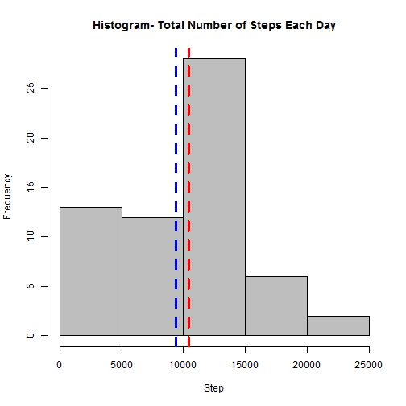
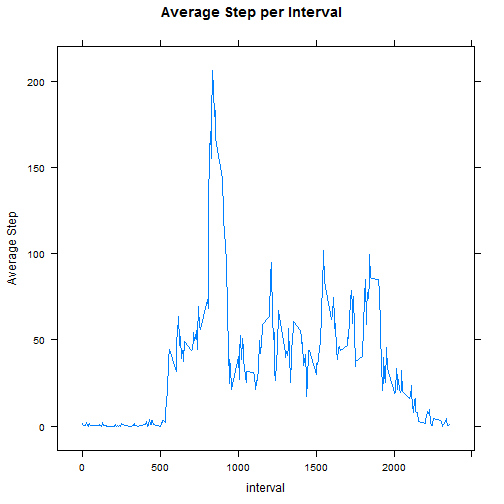
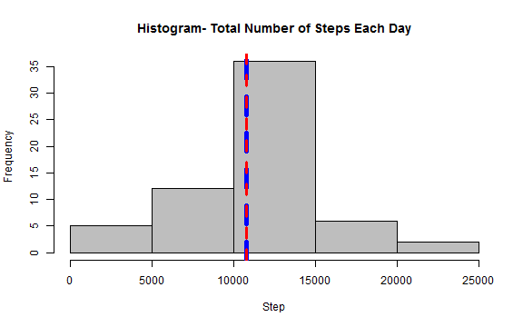

## Introduction

It is now possible to collect a large amount of data about personal movement using activity monitoring devices such as a Fitbit, Nike Fuelband, or Jawbone Up. These type of devices are part of the "quantified self"" movement - a group of enthusiasts who take measurements about themselves regularly to improve their health, to find patterns in their behavior, or because they are tech geeks. But these data remain under-utilized both because the raw data are hard to obtain and there is a lack of statistical methods and software for processing and interpreting the data.

This assignment makes use of data from a personal activity monitoring device. This device collects data at 5 minute intervals through out the day. The data consists of two months of data from an anonymous individual collected during the months of October and November, 2012 and include the number of steps taken in 5 minute intervals each day.


```r
library(caret)
library(reshape)
```

## Loading and preprocessing the data

1. The required libraries were loaded into R (analysis interface).

2. The activity monitoring data was read into a data frame for further processing.  The date field was read as strings instead of factors(default).


```r
# unzip("repdata-Fdata-Factivity.zip")
actData <- read.csv("activity.csv", header=T, stringsAsFactors=F)
```

```
## Warning: cannot open file 'activity.csv': No such file or directory
```

```
## Error: cannot open the connection
```

## What is mean total number of steps taken per day?


```r
# Find mean with tapply and melt (from reshape)
totalStep <- with(actData, tapply(steps, date, sum, na.rm=T));
totalStep <- melt(totalStep);

# Add column names
colnames(totalStep) <- c("date", "step");
totalStep$date <- as.Date(as.character(totalStep$date))

histStep <- with(totalStep, hist(step, breaks=5,  col="grey", xlab="Step", ylab="Frequency", main="Histogram- Total Number of Steps Each Day"))

# Add Mean and Median to the Histogram
abline(v=mean(totalStep$step), lwd=3, lty="dashed", col="blue") # Mean - Blue Line
abline(v=median(totalStep$step), lwd=3, lty="dashed", col="red") # Median Red line
```

 


Print Mean and Median of Total number of steps taken each day

```r
print(mean(totalStep$step))
```

```
## [1] 9354
```

```r
print(median(totalStep$step))
```

```
## [1] 10395
```


## What is the average daily activity pattern?


```r
# Find mean with tapply and melt (from reshape)
avgStep <- with(actData, tapply(steps, interval, mean, na.rm=T));
avgStep <- melt(avgStep);

# Add column names
colnames(avgStep) <- c("interval", "meanstep");

# Print Histogram with Mean and Median
tsStep <- with(avgStep, xyplot(meanstep ~ interval, type="l", xlab="interval", ylab="Average Step", main="Average Step per Interval"))

print(tsStep);
```

 

Find the record with max step(averaged across days)

```r
IntMaxStep <- avgStep[avgStep$meanstep==max(avgStep$meanstep), ]
print(IntMaxStep)
```

```
##     interval meanstep
## 104      835    206.2
```


## Imputing missing values
Total records with "NA" (rows):

```r
# Total Missing values in "steps"
totalNA <- (actData[is.na(actData$step)==T, ])

# Total records with "NA" (rows)
length(totalNA$steps)
```

```
## [1] 2304
```

Replace "NA" with mean for the intervals across all dates:
Since the original data is continuous and look like normal distributed, it can be imputed with mean values for respective intervals. The following for loop accomplishes the task, though inefficient.


```r
actDatamiss <- actData  # create a new data set
for (i in 1: length(actDatamiss$interval)) {
  if (is.na(actDatamiss[i, 1])) {
     for (j in 1 : length(avgStep$interval)) {
        if (actDatamiss[i, 3] == avgStep[j, 1]) {
           actDatamiss[i, 1]  <- avgStep[j,2]
           # print(actData[i, ])
        }
     }
  }
}
```

Now compute the histogram and mean and median exactly the same way as above, this time with the new dataset

```r
# Find mean with tapply and melt (from reshape)
totalStepnewmiss <- with(actDatamiss, tapply(steps, date, sum, na.rm=T));
totalStepnewmiss <- melt(totalStepnewmiss);

# Add column names
colnames(totalStepnewmiss) <- c("date", "step");
totalStepnewmiss$date <- as.Date(as.character(totalStepnewmiss$date))


# Print Histogram with Mean and Median
histStepmiss <- with(totalStepnewmiss, hist(step, breaks=5,  col="grey", xlab="Step", ylab="Frequency", main="Histogram- Total Number of Steps Each Day"))

# Add Mean and Median to the Histogram
abline(v=mean(totalStepnewmiss$step), lwd=5, lty="dashed", col="blue") # Mean - Blue Line
abline(v=median(totalStepnewmiss$step), lwd=3, lty="dashed", col="red") # Median Red line
```

 

Print Mean and Median of Total number of steps taken each day

```r
print(mean(totalStepnewmiss$step))
```

```
## [1] 10766
```

```r
print(median(totalStepnewmiss$step))
```

```
## [1] 10766
```
The above result shows that the steps are more normally distributed and that the mean and median converge much better with the missing values having been replaced with their corresponding group mean values from respective 'intervals'

## Are there differences in activity patterns between weekdays and weekends?

Using weekdays(), a new column was created with weekend = 0 and weekdays = 1


```r
# Change date to Date class
actDatamiss$date <- as.Date(actDatamiss$date)

actDatamiss1 <- cbind(actDatamiss, wday=0)   # Initialize the 4th column


# set the values in the wday column as per the weekday. weekday =1, weekend = 0
for (i in 1: length(actDatamiss1$date)) {
  if (weekdays(actDatamiss1[i, 2], abbreviate=1) == "Sat" | weekdays(actDatamiss1[i, 2], abbreviate=1) =="Sun")
    actDatamiss1[i, 4] <- 0
  else actDatamiss1[i, 4] <- 1
  }


# Find mean with tapply and melt (from reshape)
avgStepwday <- actDatamiss1[actDatamiss1$wday==1, ]
avgStepwday <- with(avgStepwday, tapply(steps, interval, mean, na.rm=T));
avgStepwday <- melt(avgStepwday);

# Add column names
colnames(avgStepwday) <- c("interval", "step");


# Find mean with tapply and melt (from reshape)
avgStepwend <- actDatamiss1[actDatamiss1$wday==0, ]
avgStepwend <- with(avgStepwend, tapply(steps, interval, mean, na.rm=T));
avgStepwend <- melt(avgStepwend);

# Add column names
colnames(avgStepwend) <- c("interval", "step");
```

Now, plot the panel.

  
  

There are distinct different patterns of activities over weekdays and weekends for the intervals. In general the activity trend shows, that there are more number of average activities in the weekends than in the weekdays. 

  
